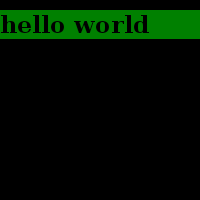

# Html to image java
A convenient library to convert your html into images

### Examples:
##### Generating a simple image
```java
import java.io.File;
import java.io.FileOutputStream;
import java.io.IOException;
import java.io.InputStream;
import java.nio.file.Files;
import java.nio.file.StandardCopyOption;
import com.dunctebot.htmltoimage.HtmlToImage;

public class Main {
    public static void main(String[] args) throws IOException {
        final byte[] bytes = HtmlToImage.htmlToPngBytes("<h1 style=\"background: green;\">hello world</h1>", 200, 200);

        try (FileOutputStream stream = new FileOutputStream(new File("image.png"))) {
            stream.write(bytes);
        }
    }
}
```
This code will generate the following image:




##### Changing the background color

